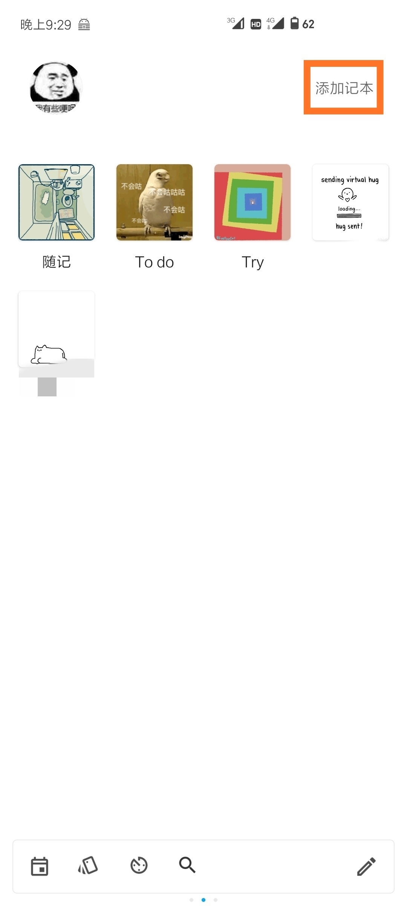
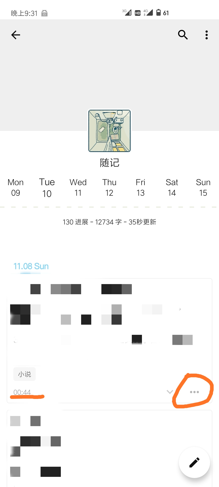
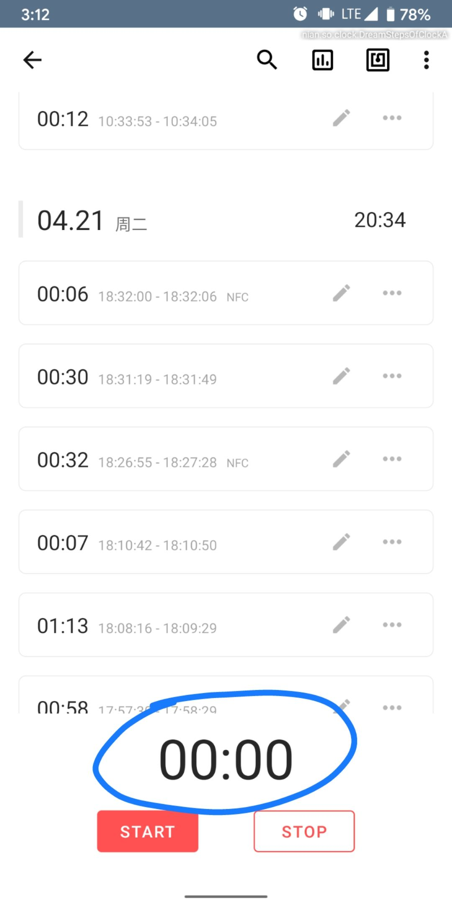
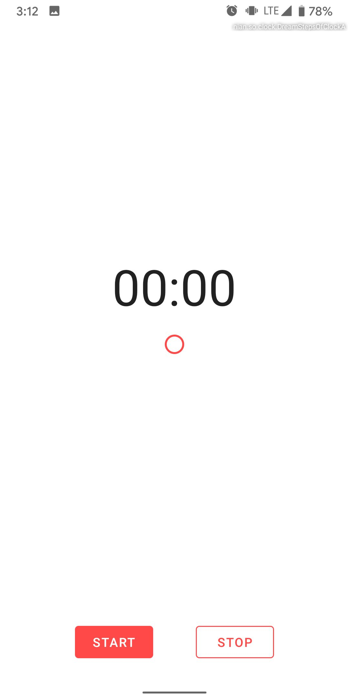
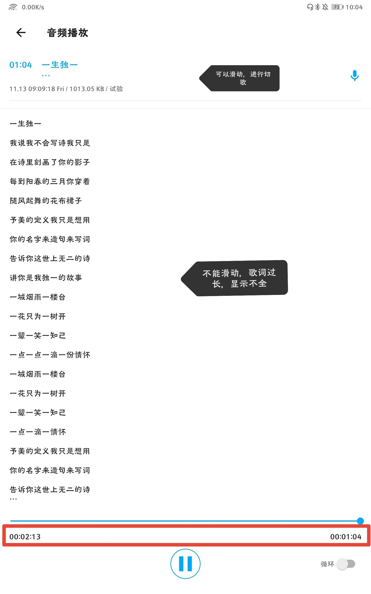

  ~~那两篇用户心得已经具体介绍念如何使用~~这里就不多做重复，主要讲收集到的小技巧或者彩蛋。分部分来讲下。

# 首页

长按添加记本，可自定义内容，改成你想显示的。

双击标准记本可直接新建进展，双击打卡记本直接打卡。打卡、计时支持NFC。

长按记本可拖动排序。`2.6.0`及其之后要到第一屏`记本排序`里修改。

首页摇一摇随机进展，可添加回应，也会出现添加补录次数。往左滑，显示最近的进展。`2.5.1`「最近进展」页新增计时、账本、打卡进展。

点击头像，进展滑过x

# 记本

长按进展可直接编辑。如有链接要按底部时间那行。

长按更多按钮（三个点），可快速复制。

# 进展编辑

右上角有小工具，可左滑添加相应项。`2.5.1`实验室-进展编辑页-自定义工具栏，可长按拖动排序。

点击字数，隐藏工具栏。如果不统一，实验室里关闭进展编辑页临时修复。

# 其他
设置-关于，点击宠物，会出现时间进度条（自己发现）。

设置倒计时xx天，进展以2020-05-21 格式为开头。新版有纪念日/倒数日，但无法添加到桌面。

自带小工具，满减计算、日期间隔、休闲娱乐。

常驻通知，可选特定记本。摘抄或补录时可用。补录可用`补录进展`（`2.2.0`放宽至每月30次），或者手动修改时间再写。

# 同步
自动轻备份，在backups目录，只有文本数据。如果不小心清理空间时误删，可手动把 xx.bak 改为 nian.db 放到 nian 文件夹中即可。

文件夹说明，nian存放图片（默认为剪切，可到实验室关闭）、文本。 nian_audio音频， nian_video视频，插入视频时，最好放到nian_video下，再选择插入。清理空间记得加入白名单。

个人是隔段时间备份，用syncthing同步到家里电脑，上传网盘。`2.5.1`及其之后无自带备份，需手动压缩备份。

或者用FolderSync（莴笋_君推荐）同步文件。其他同步工具也可。具体教程可看这里 https://www.coolapk.com/feed/21594226  

#  更新
记账 长按确认可以不退出页面记下一笔；长按顶部标题可在支出和收入之间切换。

计时:

走动的时间数字是可以点击展开全屏的。

中间的色环点击进入纯黑模式。

保存喜欢的歌曲by你瞅瞅你。录制音频保存。移动歌曲到nian_audio文件夹。重命名，如“audio_2020_11_13_09_09”，同时删掉原来的音频。歌词复制到进展即可。

*不知不觉也写了这么久*。有的功能，比如制卡，用得不多，加上那两篇有说到，就略过。当然也有没发现的，欢迎各位使用nian。如“你瞅瞅你”说的倘使有一个念的展览大会，你会发现每一个都是不一样的。

`下载地址` https://www.coolapk.com/apk/sa.nian.so 

这里附上nian历史图标。

  

